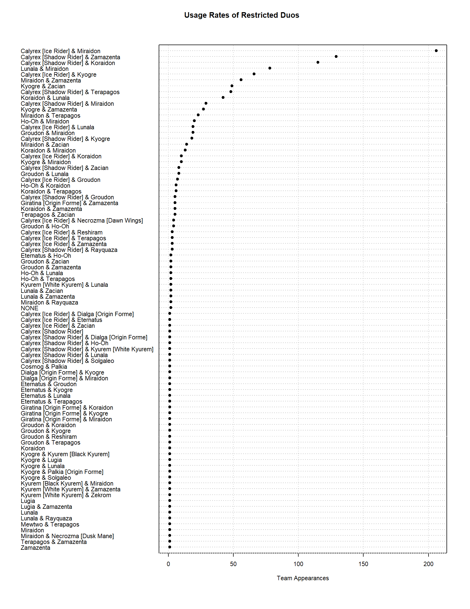
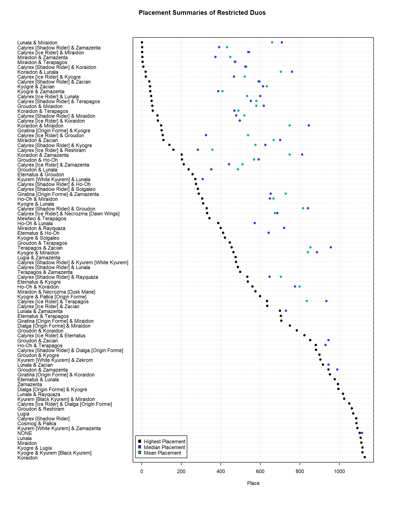
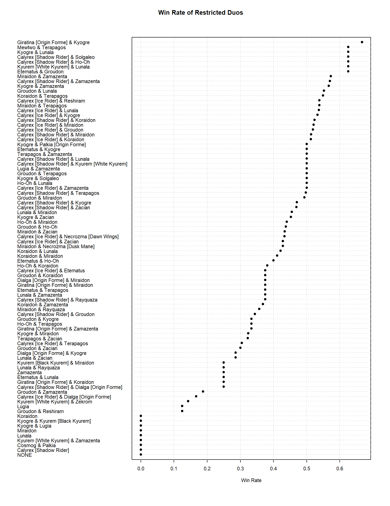
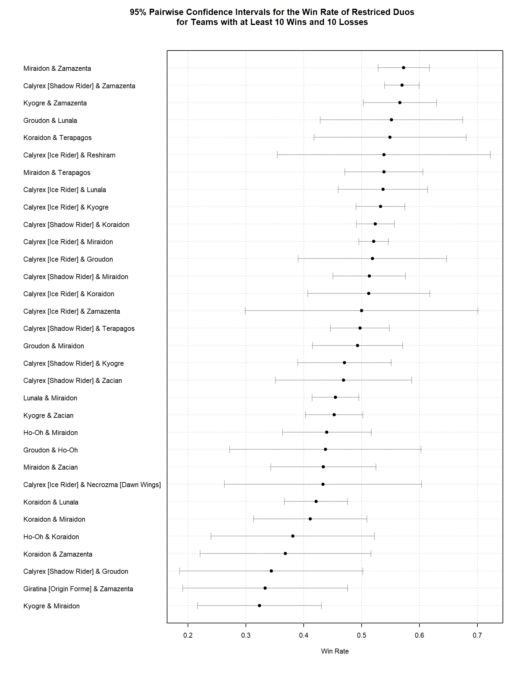

# Exploratory Analysis of VGC Restricted Pairs at Pokemon's North America International Championship

## Introduction

Pokemon Video Game Championships (VGC) is the official competitive format for the Pokemon video game series by The Pokemon Company and the [Play! Pokemon](https://www.pokemon.com/us/play-pokemon) program. Derived from the popular Pokemon video game series, the VGC format sees individuals forming teams of six Pokemon to battle other teams in a simultaneous-turn-based contest.

Similar to popular trading card games, individuals are able to form their teams from a wide range of available characters that can be customized as players see fit. The pool of Pokemon that are available to be selected for an individual's team are determined by the current regulation format. As of 7/24/2025, the current regulation format is [Regulation I](https://scarletviolet.pokemon.com/en-us/events/regulation-i/).

Regulation I is known as a "double restricted" format-- allowing each team to include up to two (typically) more powerful restricted special Pokemon. Teams designed for play in double restricted formats are typically designed to support their duo of powerful restricted Pokemon and enable them to take advantage of their strong moves and unique abilities.

This repository aims to perform an exploratory data analysis of restricted duos, gaining insight into their performance and seeing how their teams are constructed.

## Data Cleaning

The data used here come from the masters division of the most recent Regulation I tournament, as of the time of writing, the North America International Championship 2025 (NAIC) and can be found [here](https://www.pokedata.ovh/standingsVGC/0000149/masters/)

In the file [generateTeamLists.R](scripts/generateTeamLists.R), the JSON file is parsed and formatted into a dataframe including just the name of each individual competitor, and a single name representing restricted Pokemon used on their team. In the file [matrixGenerationAndWinRates.R](scripts/matrixGenerationAndWinRates.R), we iterate over the previous dataframe to generate an adjacency matrix $A$ such that $a_{i,j}$ is the number of wins that a restricted duo $i$ has against team $j$. These are the key to constructing graphs for our network analysis.

Additionally, there is a "Top Cut" adjacency matrix that is generated as well in matrixGenerationAndWinRatesTOP.R](scripts/matrixGenerationAndWinRatesTOP.R). Again, this matrix indicates which duos have victories over others; however, we only look at teams that placed in the top 100 of the final standings (about the top 10%). Since these tournaments are open signups, subsetting our data may give better insight into these matchups at a higher level.

## Analysis

### Usage Rate and Placement
The most immediate statistics we might look at is of the usage and placement of each of these duos. These are found in the (poorly named) file, [dotplots.R](scripts/dotplots.R). 

Looking at usage rates, we see a clear front-runner in the popularity contest. The duo of ***Calyrex Ice Rider & Miradon*** are obvious favorites, representing themselves on over 200 different teams. Rounding out the top three are the pairs of ***Calyrex Shadow Rider & Zamazenta*** as well as ***Calyrex Shadow Rider & Koraidon*** who have relatively close usage rates. Although they sit clearly above the rest of the field, these two duos are still dwarfed in usage rate by the most popular team. Interestingly enough, just outside this top three is the winning pair of ***Lunala & Miraidon***. Although this pair has the fourth highest usage rate, it still falls substantially below the usage rate of the top three duos.

The usage rate chart below is not only useful for seeing overall placements, but it also can provide some insight into how difficult a team might be to succeed with. For example, the duo of ***Lunala & Miraidon***-- which was present on around 75 teams and was able to ultimately take the whole tournament-- has both an average and median placement that is much lower than many of the other teams who secured top ten finishes. While a team's final performance depends on much more than just the selection of two individual pieces, general observation might suggest that the ***Lunala & Miraidon*** combo is one that is plenty powerful, but it is difficult to pull off for the average player. Unsurprisignly, many of the teams that we see performing well are also teams with high usage rates seen before.

### Win Rates

Overall win rates are calculated and presented in the file [matrixGenerationAndWinRates.R](scripts/matrixGenerationAndWinRates.R).

This file presents both a complete look at winrates for every restricted pair as well as a series of simultaneously adjusted confidence intervals for teams that have at least ten wins and ten losses (this is a necessary restriction to easily generate confidence intervals using a normal approximation). The results of the first of these charts are rather interesting. Rather obscure duos such as ***Giratina Origin Forme & Zamazenta***, ***Mewtwo & Terapagos***, as well as a few others top out the list with over a 60% win rate. Why do these uncommon pairing perform so well? It's likely a result of the Swiss round format employed by these tournaments. If an individual using a unique team is able to make a strong 7-3 or 6-3 run before being eliminated, the win rate of their restricted pair will appear high. Similarly, a number of less skilled players attempting to copy the team of someone more skilled are able to rack up lots of losses throughout the course of the day before all being eliminated. Doing this results in low win rates for even the best performing teams at each tournament.

Similar observations can be seen in the below chart with the added benefit of simultaneous confidence intervals. Removing restricted pairs with very few wins or losses gives a better picture of the actual performance of different pairs and allows us to ignore those with a small number of matches played and a lucky (or unlucky) streak. 

### Matchup Win Rates

